# Google Playstore 应用数据集聚类分析（SOM）

## 1. 项目简介

本项目旨在利用**自组织映射（Self-Organizing Map, SOM）** 对 Google Playstore 应用数据集进行无监督聚类分析。通过对应用的多维特征（如评分、安装量、大小、是否免费、广告支持等）进行学习，将相似的应用映射到二维网格上，从而直观地发现不同类别应用的分布规律和特征模式，加深对应用市场生态的理解。

---

## 2. 数据集说明

### 2.1 数据来源

数据来自 GitHub 开源仓库：  
[gauthamp10/Google-Playstore-Dataset](https://github.com/gauthamp10/Google-Playstore-Dataset.git)  
可通过 `git clone` 直接下载。

### 2.2 数据规模

原始数据集总计 **600+ MB**，包含多个 CSV 文件，其中主文件 `Part1.csv` 记录了数十万条应用信息。由于数据量庞大（直接加载预处理耗时超过 5 分钟），本分析仅截取前 **10,000 条** 记录进行后续处理。

### 2.3 字段一览

原始数据包含以下 24 个字段（列）：

| 列号 | 中文名称           | 英文名称          |
| ---- | ------------------ | ----------------- |
| 1    | 应用名称           | App Name          |
| 2    | 应用 ID            | App Id            |
| 3    | 分类               | Category          |
| 4    | 评分               | Rating            |
| 5    | 评分数量           | Rating Count      |
| 6    | 安装量（显示）     | Installs          |
| 7    | 安装量（最小值）   | Minimum Installs  |
| 8    | 安装量（最大值）   | Maximum Installs  |
| 9    | 是否免费           | Free              |
| 10   | 价格               | Price             |
| 11   | 货币类型           | Currency          |
| 12   | 应用大小           | Size              |
| 13   | 最低支持安卓版本   | Minimum Android   |
| 14   | 开发者 ID          | Developer Id      |
| 15   | 开发者网站         | Developer Website |
| 16   | 开发者邮箱         | Developer Email   |
| 17   | 上线时间           | Released          |
| 18   | 最近更新时间       | Last Updated      |
| 19   | 内容分级           | Content Rating    |
| 20   | 隐私政策链接       | Privacy Policy    |
| 21   | 是否含广告         | Ad Supported      |
| 22   | 是否含应用内购买   | In App Purchases  |
| 23   | 是否为编辑推荐应用 | Editors Choice    |
| 24   | 抓取时间           | Scraped Time      |

---

## 3. 数据预处理

### 3.1 数据截取

由于完整数据集过大，我们编写了两个 MATLAB 脚本，从 `Part1.csv` 中提取**前 10,000 行**，生成子集用于后续分析。截取后的数据大小适中，预处理和训练效率大幅提升。

### 3.2 特征选择

与聚类无关的字段（如名称、ID、开发者信息、时间戳等）被剔除。最终选用的**聚类特征**如下：

| 原始列号 | 中文名称         | 英文名称         | 选择理由                             |
| -------- | ---------------- | ---------------- | ------------------------------------ |
| 4        | 评分             | Rating           | 反映软件质量                         |
| 5        | 评分数量         | Rating Count     | 体现用户参与度                       |
| 7        | 安装量（最小值） | Minimum Installs | 反映流行程度                         |
| 8        | 安装量（最大值） | Maximum Installs | 反映流行程度                         |
| 12       | 应用大小         | Size             | 可间接反映软件类型（如游戏通常较大） |
| 9        | 是否免费         | Free             | 收费模式                             |
| 21       | 是否含广告       | Ad Supported     | 结合 `Free` 可判断盈利方式           |
| 22       | 是否含应用内购买 | In App Purchases | 结合广告可判断商业模式               |

此外，**分类（Category，列3）** 虽不直接参与聚类，但作为**验证标签**，用于评估聚类结果的准确性和可解释性。

---

## 4. 聚类方法：自组织映射（SOM）

采用 **SOM** 神经网络对预处理后的 10,000 条样本进行聚类。  

- **拓扑结构**：六边形网格（默认），相邻神经元通过边连接，形成规则的二维平面。  
- **训练过程**：无监督竞争学习，将高维输入映射到低维网格，保持输入空间的拓扑关系。  

在结果分析中，主要关注以下可视化图形：

- **SOM 邻点距离图**（U-matrix）：显示相邻神经元间的距离，颜色越深表示距离越大（类间边界），颜色越浅表示距离小（类内聚合）。
- **SOM 采样命中图**：标注每个神经元被分配的样本数，颜色越深（或数字越大）表示该区域是热门聚类中心。
- **SOM 输入平面图**：针对每个输入特征，展示该特征在整个网络上的分布，颜色表示特征值高低。
- **SOM 权重位置图 + 分类标签**：展示各神经元在特征空间中的权重中心，并可叠加原始类别标签，便于定性分析。

---

## 5. 聚类结果与分析

### 5.1 总览

下图展示了 SOM 邻点距离图（将网格划分为 5 个区域以便细看）：

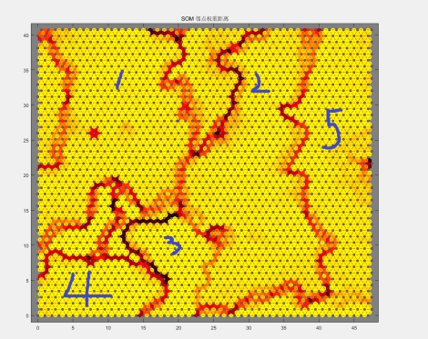

从图中可以清晰看到几个明显的**深色区域边界**，它们将网格划分为若干聚类区域，这与小尺寸 SOM 网络（如 8×8）模糊不清的效果形成鲜明对比，说明本次采用较大网格（如 10×10 或更大）能够更精确地揭示数据分布结构。

---

### 5.2 分区详细解读

#### 区域 1（左上部分）

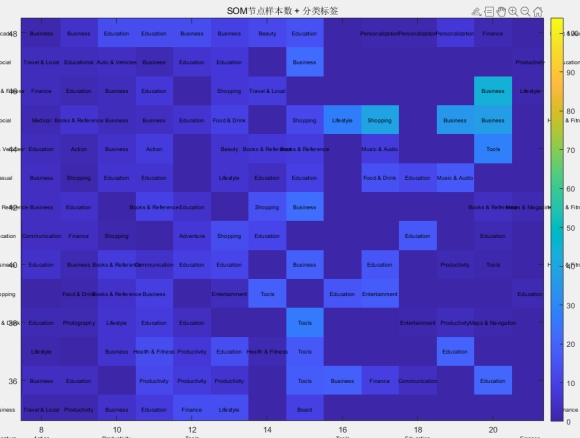  
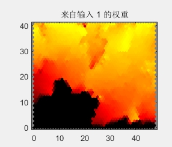

- 该区域主要聚集了 **Business、Education、Shopping** 类应用。
- 这些应用多为企业内部或学校使用，通常开发粗糙、用户评分较低（对应 `Rating` 输入平面图中此处颜色最浅）。
- 聚类效果显著，同类别紧密相邻。

---

#### 区域 2（上中部）

该区域又可分为上下两部分：

- **上半部分**（以 `Music & Audio` 为主）：  
  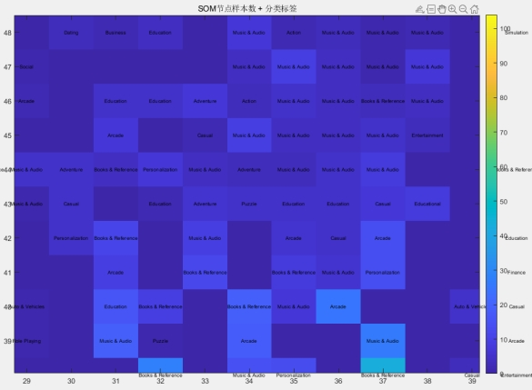  
  音乐类应用因版权问题普遍需要付费，因此**内购特征（In App Purchases）** 在此区域占主导（输入平面图显示为深色，见下图）。  
  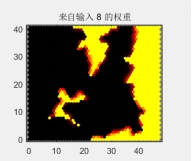  
  所有音乐应用均集中于此处，聚类边界清晰。

- **下半部分**（以 `Books & Reference` 为主，兼有 Education、Tool、Personalization、Lifestyle 等）：  
  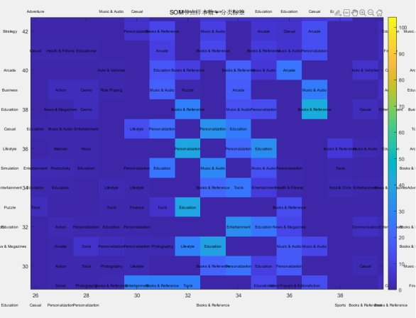  
  这些应用均属**轻量级**（Size 较小），没有 Entertainment 类的大型软件。  
  同时，该区域也以**内购（深色）** 为突出特征（与上半部分一致）。  
  尤其值得关注的是，`Personalization` 类应用高度集中于某一两个神经元（命中图中颜色最深），因为个性化定制通常需要付费，这与聚类结果吻合。

---

#### 区域 3（中右部）

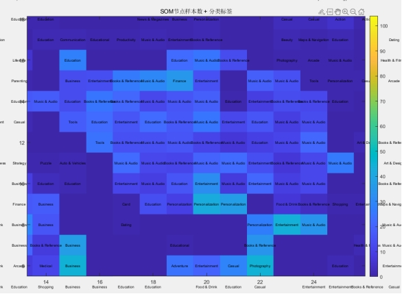  
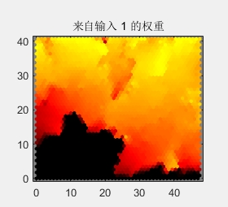

- 该区域包含多种常见类型（Music & Audio、Education、Personalization、Entertainment、Books & Reference 等），但 **Music & Audio** 依然聚集在一起，说明即使在“鱼龙混杂”中，SOM 仍能保持同类邻近。
- 此区域的共同特点是**评分（Rating）较高**（输入平面图中颜色深），表明这里的应用都是表现优秀的热门软件，因此尽管类别多样，但都被高评分这一共性吸引到同一区域。

---

#### 区域 4（右下部）

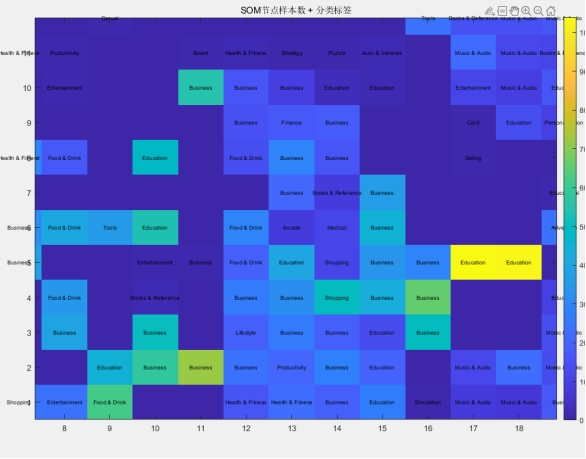  
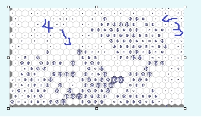

- 大量 `Business` 类应用聚集于此，同时两个最深的神经元被 `Education` 占据，推测二者特征相似，但 Education 的特征更突出，因此吸引更多样本。
- 命中图显示这两个神经元被击中次数超过 30 次，相邻的 Business 神经元也高达 30+，聚类效果极佳。

---

#### 区域 5（下部狭长区域）

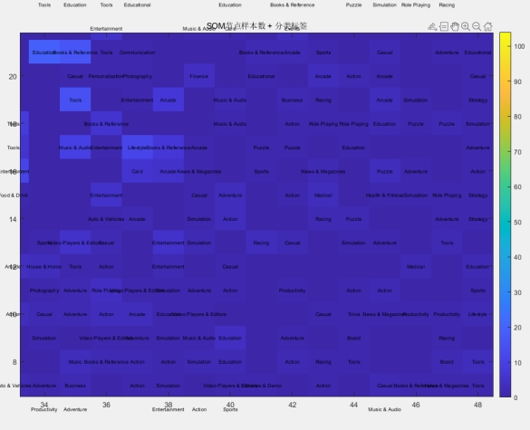

- 该区域包含极为**冷门**的类型，例如 Puzzle、Sports、Action、Racing、Simulation、Adventure、Casual、Card、Strategy、Board、Productivity、Medical 等，种类之多令人惊讶。
- 这些应用共同特征是：**免费、无广告、无内购**（对应输入平面图中 Free、Ad Supported、In App Purchases 均为浅色，见下图）。  
  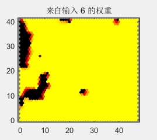  
    
  它们多为小众爱好者的非商业作品，下载量低，因此被聚类到同一区域。

---

### 5.3 图与图之间的联动解读

大尺寸 SOM 网格不仅让聚类区域一目了然，还帮助我们深入理解各可视化图表之间的**内在联系**。

- **邻点距离图与命中图的联动**：  
  下图展示了在命中图中，将连续空神经元（无样本）区域用线条划分，得到的边界形状与邻点距离图的深色区域完全吻合。  
  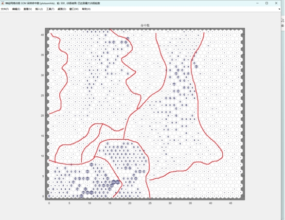  
  这说明距离图上的“山脊”正是聚类边界，而颜色浅的区域为类内密集区。

- **输入平面图与距离图的一致性**：  
  每个特征（如 Rating、Installs、Size 等）的输入平面图的颜色变化范围都与距离图的空间分布高度相关，特征值的高低恰好对应聚类区域的划分，验证了聚类结果的有效性。  
    
  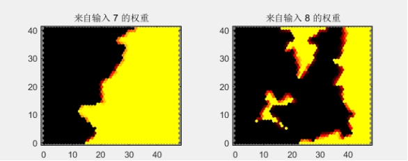

---

## 6. 个人收获与反思

通过本次实践，我深刻体会到：

1. **网格尺寸的重要性**：传统课堂中使用的 8×8 网格样本量少，难以观察聚类结构；而采用较大尺寸（如 10×10 以上）后，U-matrix 上可以清晰分辨类间边界，极大提升了对 SOM 聚类思想的理解。
2. **多图联动的价值**：邻点距离图、命中图、输入平面图三者相互印证，共同揭示数据内在结构，缺一不可。
3. **大数据的取舍**：面对庞大原始数据，合理采样和特征选择是高效分析的前提，既能保留关键信息，又能保证计算可行性。

---

## 7. 结论

- SOM 成功将 10,000 个应用划分为具有鲜明特征的区域，各区域对应不同类别组合和商业属性。
- 聚类结果与真实类别标签高度吻合，验证了所选特征的有效性。
- 大网格 SOM 可视化使分析直观、高效，为后续的推荐系统或市场细分提供了有力参考。

---

## 附录：MATLAB 脚本说明

项目中包含两个 MATLAB 脚本：

- `extract_first_10000.m`：从 `Part1.csv` 读取并提取前 10,000 行数据，保存为新的 CSV 文件。
- `som_clustering.m`：对截取后的数据进行归一化、训练 SOM 网络，并生成所有可视化图形。

使用前请确保已安装 MATLAB 的 Statistics and Machine Learning Toolbox 和 Deep Learning Toolbox（或自备 SOM 工具箱）。

